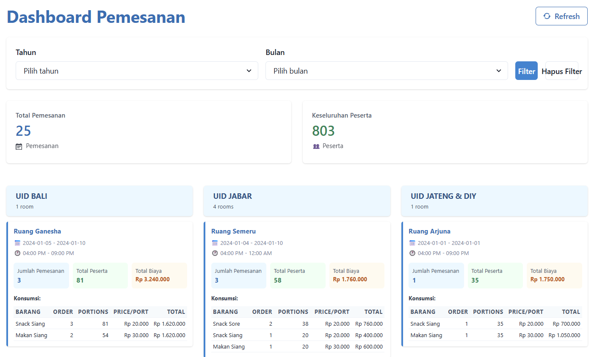

# Home Test Application Setup

## Overview
This is a home test requirement project. Follow the steps below to run the application.

## Prerequisites
- Ensure Go (Golang) is installed on your machine.
- For the frontend, ensure Node.js and npm are installed.

## Running the Backend
1. Navigate to the project root directory.
2. Run the Go application using the following command in your terminal:
    ```
    go run main.go
    ```
3. Once running, open your browser and visit `http://localhost:8000/v1/booking/summary` to view the application.
4. Refer to the `contract` folder for API contracts and details.

## Running the Frontend
1. Change directory to the `web` folder:
    ```
    cd web
    ```
2. Install dependencies:
    ```
    npm install
    ```
3. Start the frontend application:
    ```
    npm start
    ```

Enjoy exploring the application!

## API Example Response

The following is an example response from the API endpoint `http://localhost:8000/v1/booking/summary`:

```json
[
    {
        "officeName": "UID BALI",
        "rooms": [
            {
                "roomName": "Ruang Ganesha",
                "bookingCount": 3,
                "totalParticipants": 81,
                "consumptions": [
                    {
                        "consumptionName": "Snack Siang",
                        "count": 3,
                        "totalCost": 1620000
                    },
                    {
                        "consumptionName": "Makan Siang",
                        "count": 2,
                        "totalCost": 1620000
                    }
                ],
                "bookingStartDate": "2024-01-05",
                "bookingEndDate": "2024-01-10",
                "startTime": "2024-01-07T09:00:00Z",
                "endTime": "2024-01-12T14:00:00Z"
            }
        ]
    },
    {
        "officeName": "UID JABAR",
        "rooms": [
            {
                "roomName": "Ruang Semeru",
                "bookingCount": 3,
                "totalParticipants": 58,
                "consumptions": [
                    {
                        "consumptionName": "Snack Sore",
                        "count": 2,
                        "totalCost": 760000
                    },
                    {
                        "consumptionName": "Snack Siang",
                        "count": 1,
                        "totalCost": 400000
                    },
                    {
                        "consumptionName": "Makan Siang",
                        "count": 1,
                        "totalCost": 600000
                    }
                ],
                "bookingStartDate": "2024-01-04",
                "bookingEndDate": "2024-01-10",
                "startTime": "2024-01-08T09:00:00Z",
                "endTime": "2024-01-13T17:00:00Z"
            },
            {
                "roomName": "Ruang Rinjani",
                "bookingCount": 1,
                "totalParticipants": 27,
                "consumptions": [
                    {
                        "consumptionName": "Makan Siang",
                        "count": 1,
                        "totalCost": 810000
                    },
                    {
                        "consumptionName": "Snack Sore",
                        "count": 1,
                        "totalCost": 540000
                    }
                ],
                "bookingStartDate": "2024-01-06",
                "bookingEndDate": "2024-01-06",
                "startTime": "2024-01-08T13:00:00Z",
                "endTime": "2024-01-08T16:00:00Z"
            },
            {
                "roomName": "Ruang Galunggung",
                "bookingCount": 1,
                "totalParticipants": 23,
                "consumptions": [
                    {
                        "consumptionName": "Snack Siang",
                        "count": 1,
                        "totalCost": 460000
                    },
                    {
                        "consumptionName": "Makan Siang",
                        "count": 1,
                        "totalCost": 690000
                    },
                    {
                        "consumptionName": "Snack Sore",
                        "count": 1,
                        "totalCost": 460000
                    }
                ],
                "bookingStartDate": "2024-01-04",
                "bookingEndDate": "2024-01-04",
                "startTime": "2024-01-07T09:00:00Z",
                "endTime": "2024-01-07T16:00:00Z"
            },
            {
                "roomName": "Ruang Bromo",
                "bookingCount": 1,
                "totalParticipants": 20,
                "consumptions": [
                    {
                        "consumptionName": "Snack Siang",
                        "count": 1,
                        "totalCost": 400000
                    },
                    {
                        "consumptionName": "Makan Siang",
                        "count": 1,
                        "totalCost": 600000
                    },
                    {
                        "consumptionName": "Snack Sore",
                        "count": 1,
                        "totalCost": 400000
                    }
                ],
                "bookingStartDate": "2024-01-15",
                "bookingEndDate": "2024-01-15",
                "startTime": "2024-01-17T09:00:00Z",
                "endTime": "2024-01-17T16:00:00Z"
            }
        ]
    }
]
## Frontend Example

Below is a screenshot of the frontend application:


```
